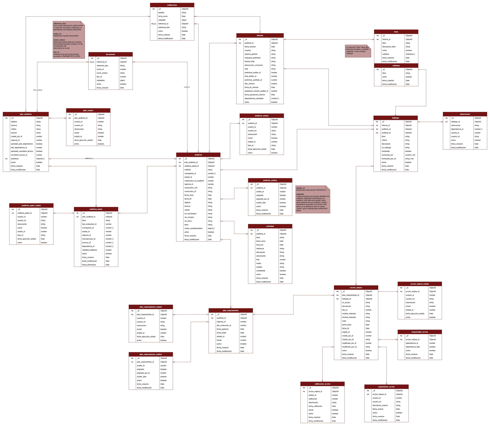

# plan_anual_auditoria_crud
El API crud permite gestionar planes anuales de auditoria asi como sus auditorias.

## Especificaciones Técnicas

### Tecnologías Implementadas y Versiones
* [NestJS 12](https://nestjs.com/)
* [TypeScript 6.0](https://www.typescriptlang.org/)
* [Mongoose 7](https://mongoosejs.com/) sobre [MongoDB](https://www.mongodb.com/)
* [pnpm 11](https://pnpm.io/) como gestor de paquetes
* Node.js >= 22.12 (requerido: los paquetes de NestJS 12 son ESM-only y se cargan vía `require(esm)`)

### Variables de Entorno

| Variable | Descripción |
| -- | -- |
| `PLAN_ANUAL_AUDITORIA_HOST` | Host de MongoDB |
| `PLAN_ANUAL_AUDITORIA_PORT` | Puerto de MongoDB |
| `PLAN_ANUAL_AUDITORIA_DB` | Nombre de la base de datos |
| `PLAN_ANUAL_AUDITORIA_AUTH_DB` | Base de datos de autenticación (`authSource`) |
| `PLAN_ANUAL_AUDITORIA_USER` | Usuario de MongoDB |
| `PLAN_ANUAL_AUDITORIA_PASS` | Contraseña de MongoDB |
| `PARAMETER_STORE` | Opcional. Prefijo en AWS SSM Parameter Store; si está definido, `USER` y `PASS` se leen de `/<PARAMETER_STORE>/plan_anual_auditoria_crud/db/{username,password}` en lugar del entorno |

El API expone el puerto `8080` y la documentación Swagger en `/swagger`.

### Ejecución del Proyecto
```shell
# 1. Clonar el repositorio y moverse a la rama develop
git clone https://github.com/udistrital/plan_anual_auditoria_crud.git
cd plan_anual_auditoria_crud
git checkout develop

# 2. Instalar dependencias
pnpm install

# 3. Definir las variables de entorno (ver tabla anterior)

# 4. Ejecutar el proyecto
pnpm run start        # producción local
pnpm run start:dev    # con recarga automática
```

### Ejecución Pruebas
```shell
pnpm run typecheck    # verificación de tipos
pnpm run lint         # análisis estático
pnpm test             # pruebas unitarias (jest, archivos .spec.ts)
pnpm run test:cov     # pruebas con cobertura
pnpm audit            # vulnerabilidades en dependencias
```

### Base de Datos

Base de datos MongoDB gestionada con Mongoose. Para levantar una instancia local:

```shell
# Requiere PLAN_ANUAL_AUDITORIA_USER, _PASS y _DB definidas en el entorno
docker compose up -d mongo
```

Se crean 22 colecciones, organizadas en dos dominios:

* **Auditorías**: `plan_auditoria`, `plan_estado`, `auditoria_padre`, `auditoria_padre_estado`, `auditoria`, `auditoria_estado`, `auditoria_auditor`, `actividad`, `informe`, `tema`, `documento`, `observacion`, `notificacion`.
* **Planes de mejoramiento**: `plan_mejoramiento`, `plan_mejoramiento_estado`, `plan_mejoramiento_auditor`, `responsable_accion`, `accion_mejora`, `accion_mejora_estado`, `seguimiento_accion`, `calificacion_accion`.

El detalle de campos, tipos y relaciones de cada colección está en el [Diccionario de Datos](database/Diccionario.md).

### Docker

La imagen se construye a partir del artefacto compilado (`dist/`) y las dependencias ya instaladas en `node_modules`, que deben quedar acotadas a producción antes de construir la imagen:

```shell
pnpm install && pnpm run build
pnpm install --prod --frozen-lockfile
docker build -t plan_anual_auditoria_crud .
docker run -p 8080:8080 \
  -e PLAN_ANUAL_AUDITORIA_HOST=... -e PLAN_ANUAL_AUDITORIA_PORT=27017 \
  -e PLAN_ANUAL_AUDITORIA_DB=... -e PLAN_ANUAL_AUDITORIA_AUTH_DB=admin \
  -e PLAN_ANUAL_AUDITORIA_USER=... -e PLAN_ANUAL_AUDITORIA_PASS=... \
  plan_anual_auditoria_crud
```

## Estado CI

| Develop | Release 0.0.1 | Master |
| -- | -- | -- |
| [](https://hubci.portaloas.udistrital.edu.co/udistrital/plan_anual_auditoria_crud/) | [](https://hubci.portaloas.udistrital.edu.co/udistrital/plan_anual_auditoria_crud/) | [](https://hubci.portaloas.udistrital.edu.co/udistrital/plan_anual_auditoria_crud/) |

## Modelo de Datos


Fuente editable: [ModeloDatosSisifov2.drawio](database/ModeloDatosSisifov2.drawio) · Versión vectorial: [ModeloDatosSisifov2.svg](database/ModeloDatosSisifov2.svg)

## Licencia

This file is part of plan_anual_auditoria_crud.

plan_anual_auditoria_crud is free software: you can redistribute it and/or modify it under the terms of the GNU General Public License as published by the Free Software Foundation, either version 3 of the License, or (at your option) any later version.

plan_anual_auditoria_crud is distributed in the hope that it will be useful, but WITHOUT ANY WARRANTY; without even the implied warranty of MERCHANTABILITY or FITNESS FOR A PARTICULAR PURPOSE. See the GNU General Public License for more details.

You should have received a copy of the GNU General Public License along with novedades_crud. If not, see https://www.gnu.org/licenses/.
